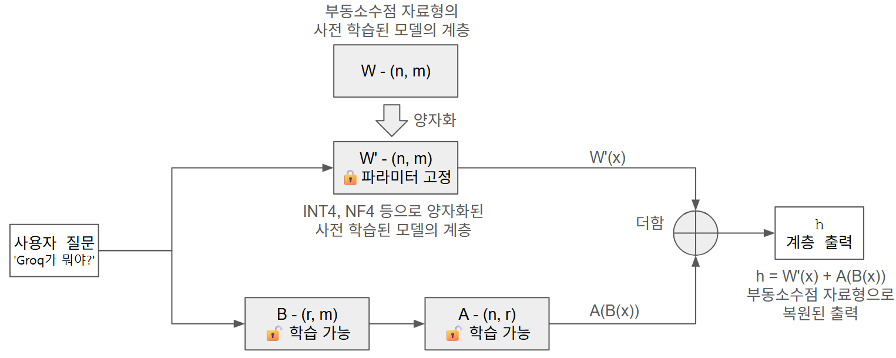

# QLoRA — 작은 가속기에서 큰 모델을 미세 조정하기

> **12장 12-3절 심화 학습 자료**
> 예제 노트북: [`qlora_example.ipynb`](qlora_example.ipynb)
> 선수 지식: 8-4절(전이 학습), 10-3절(디코더만 사용하는 트랜스포머), 12-2절(미세 조정), 12-3절(양자화)

12-2절에서 KoBART를 미세 조정해 요약기를 만들었다. 1억 2천만 파라미터짜리 모델이라 파라미터 전부를 갱신하는 **전체 미세 조정**으로도 무리가 없었다.

그런데 12-3절에서 다룬 3B 모델은 사정이 다르다. 추론만 해도 FP16으로 6GB를 쓰는데, 학습하려면 기울기 텐서와 옵티마이저 상태까지 올려야 한다. 어림잡아 **파라미터 하나당 16바이트**, 3B 모델이면 **48GB**다. 개인용 그래픽카드로는 시작조차 할 수 없다.

이 글은 그 벽을 넘는 방법을 다룬다. **LoRA**는 갱신할 파라미터를 0.14%로 줄이고, **QLoRA**는 거기에 4비트 양자화를 얹어 나머지 99.86%가 차지하는 메모리마저 4분의 1로 줄인다. 12GB 그래픽카드 한 장으로 7B 모델을 미세 조정할 수 있게 된다.

---

## 1. 미세 조정의 메모리 예산

### 1.1 학습은 추론보다 훨씬 무겁다

추론할 때 가속기 메모리에 올라가는 것은 **모델 가중치**와 약간의 활성화값뿐이다. 학습은 여기에 세 가지가 더 붙는다.

| 무엇 | 크기 (파라미터 하나당) | 왜 필요한가 |
|---|---|---|
| 모델 가중치 | 2바이트 (FP16) | 순전파 |
| **기울기** | 2바이트 (FP16) | 역전파 결과를 담아 둔다 |
| **옵티마이저 상태** | **8바이트** (FP32 1차·2차 모멘트) | AdamW가 파라미터마다 두 개의 이동 평균을 유지한다 |
| 마스터 가중치 | 4바이트 (FP32) | 혼합 정밀도에서 갱신 정확도를 지키려고 따로 둔다 |
| 합계 | **약 16바이트** | |

여기에 **활성화 메모리**가 더해진다. 역전파를 하려면 순전파 중간 결과를 붙들고 있어야 하는데, 어텐션은 입력 토큰 수의 **제곱**에 비례해 늘어난다. 긴 입력을 다룰수록 이 몫이 커진다.

### 1.2 세 가지 방식의 메모리 비교

| 파라미터 수 | 전체 미세 조정 | LoRA(FP16) | **QLoRA(4비트)** |
|---|---|---|---|
| 1B | 16~20GB | 4~6GB | **2~3GB** |
| 3B | 48~60GB | 10~14GB | **5~7GB** |
| 7B | 110~140GB | 16~20GB | **8~12GB** |
| 13B | 200~260GB | 28~36GB | **12~18GB** |
| 70B | 1100GB 이상 | 160~220GB | **40~80GB** |

(FP16 혼합 정밀도와 AdamW 기준. 입력 길이, 배치 크기, 그래디언트 체크포인팅 여부에 따라 달라진다.)

**LoRA가 한 자리, QLoRA가 다시 절반 안팎을 줄인다.** 7B 모델을 보면 110GB가 16GB로, 다시 8GB로 내려온다. 데이터센터급 장비가 필요하던 일이 개인용 그래픽카드의 일이 된다.

줄어드는 방식이 둘이 다르다는 점이 중요하다.

- **LoRA는 기울기와 옵티마이저 상태를 줄인다.** 학습 대상 파라미터가 0.14%뿐이므로 파라미터 하나당 10바이트가 드는 부분이 0.14%로 쪼그라든다. 가중치 자체는 그대로다.
- **QLoRA는 가중치를 줄인다.** LoRA로도 남아 있던 모델 가중치 6GB를 4비트로 눌러 1.5GB로 만든다.

둘이 겹치지 않으므로 효과가 곱해진다.

> **그래디언트 체크포인팅**
> 활성화 메모리를 아끼는 또 하나의 방법이다. 순전파 중간 결과를 전부 들고 있는 대신 일부만 남겨 두고, 역전파 때 필요한 부분을 다시 계산한다. 계산 시간이 20~30% 늘어나는 대신 활성화 메모리가 크게 준다. 긴 입력을 다루거나 메모리가 빠듯하면 켜는 것이 좋다. `TrainingArguments(gradient_checkpointing=True)`로 켠다.

---

## 2. LoRA — 변화량만 따로 배우기

### 2.1 낮은 계수 가정

미세 조정은 사전 학습 가중치 `W`를 `W + ΔW`로 바꾸는 일이다. LoRA의 출발점은 이 **ΔW**에 대한 관찰이다.

> 사전 학습 모델을 특정 작업에 적응시킬 때 생기는 변화량 `ΔW`는
> 원래 가중치 행렬만큼 복잡하지 않다. **낮은 계수(low rank)로 충분히 근사된다.**

`W`가 `(n, m)` 행렬이라면 `ΔW`도 같은 크기다. 그런데 이 행렬의 계수(rank)가 실제로는 매우 낮다면, 두 개의 작은 행렬 곱으로 표현할 수 있다.

```
ΔW ≈ A · B        A: (n, r),  B: (r, m),  r ≪ min(n, m)
```

파라미터 수를 비교해 보자. `n = m = 4096`, `r = 16`이라면,

| | 파라미터 수 |
|---|---|
| `ΔW` 전체 | 4096 × 4096 = **16,777,216** |
| `A`와 `B` | 4096 × 16 + 16 × 4096 = **131,072** |

**128분의 1**이다. 이 `A`와 `B`만 학습하고 `W`는 고정한다.

### 2.2 원래 계층 옆에 붙인다

LoRA는 `W`를 직접 바꾸지 않는다. **원래 계층 옆에 경로를 하나 더 두고 두 출력을 더한다.**



*QLoRA의 구성. 양자화 단계를 빼고 사전 학습 모델의 가중치(W)를 그대로 쓰면 LoRA의 구성이 된다.*

입력 `x`가 두 갈래로 흐른다. 위쪽은 고정된 원래 계층, 아래쪽은 학습 가능한 어댑터다.

```
h = W(x) + (alpha / r) · A(B(x))
```

`B`가 먼저 `m`차원을 `r`차원으로 줄이고, `A`가 다시 `n`차원으로 펼친다. **병목을 통과시켜 표현력을 낮은 계수로 제한하는 것**이 이 구조의 핵심이다.

초기화도 중요하다. `A`는 0으로, `B`는 작은 난수로 채운다. 그러면 학습 시작 시점에 `A(B(x)) = 0`이 되어 **어댑터를 붙이기 전과 완전히 같은 모델**에서 출발한다. 사전 학습 성능을 망가뜨리지 않고 조금씩 옮겨 가는 셈이다.

> 위 그림은 스케일 계수 `alpha / r`을 생략했다. 실제 구현은 어댑터 출력에 이 값을 곱한 뒤 더한다.

### 2.3 결과가 달라지는 세 인자

```python
lora_config = LoraConfig(
    r=16,                                  # 저랭크 분해 차원
    lora_alpha=32,                         # 스케일 계수(alpha / r)
    target_modules=['q_proj', 'v_proj'],   # 어텐션의 Q, V 선형 계층에만 적용
    lora_dropout=0.05,
    bias='none',
    task_type='CAUSAL_LM',                 # 인과 언어 모델(Llama, GPT 등 디코더 전용)
)
```

**`r`(랭크)** — 어댑터의 크기다. 클수록 표현력이 커지지만 메모리와 학습 시간도 함께 는다. **4~16에서 시작해 결과를 보며 올린다.** 데이터가 적을수록 작은 `r`이 낫다. 큰 `r`은 적은 데이터에 과적합하기 쉽다.

**`lora_alpha`(스케일 계수)** — 어댑터 출력에 곱해지는 배율은 `lora_alpha / r`이다. `r=16, lora_alpha=32`면 2.0이다.

이 인자가 따로 있는 이유가 있다. **`r`을 바꿀 때 학습률을 다시 잡지 않아도 되게 하려는 장치**다. `r`을 키우면 `A·B`의 출력 크기가 자연히 커지는데, `r`로 나누어 두면 그 효과가 상쇄된다. 그래서 보통 **`lora_alpha`를 `r`의 두 배로 두고 `r`만 조정한다.**

**`target_modules`(적용 위치)** — 어느 선형 계층 옆에 어댑터를 붙일지 정한다.

| 설정 | 학습 파라미터 | 성격 |
|---|---|---|
| `['q_proj', 'v_proj']` | 가장 적다 | LoRA 논문의 기본. 대부분의 작업에서 충분하다 |
| `['q_proj', 'k_proj', 'v_proj', 'o_proj']` | 두 배 | 어텐션 전체 |
| `'all-linear'` | 가장 많다 | 피드포워드까지. 효과는 커지지만 메모리와 시간도 는다 |

**`['q_proj', 'v_proj']`로 시작한다.** 어텐션에서 "무엇을 찾을지"(Q)와 "무엇을 가져올지"(V)를 조정하는 것만으로 작업 적응의 상당 부분이 해결되기 때문이다.

**`lora_dropout`** — 어댑터 경로에만 적용하는 드롭아웃이다. 원래 계층은 건드리지 않는다. 데이터가 적을 때 과적합을 막는다.

**`task_type`** — 모델 구조에 맞춰 지정한다. Llama나 GPT처럼 인과 마스크를 쓰는 디코더 전용 모델은 `'CAUSAL_LM'`이다.

### 2.4 실제로 얼마나 줄어드는가

Bllossom-3B에 위 설정으로 어댑터를 붙이면 이렇게 나온다.

```
trainable params: 4,587,520 || all params: 3,217,337,344 || trainable%: 0.1426
```

**32억 개 중 459만 개, 0.14%만 학습한다.** 기울기와 옵티마이저 상태가 이 0.14%에만 필요하므로, 파라미터 하나당 10바이트가 드는 몫이 32GB에서 46MB로 줄어든다.

---

## 3. 양자화를 얹으면 — QLoRA

LoRA로도 **모델 가중치 6GB는 그대로** 남는다. QLoRA는 여기에 12-3절의 4비트 양자화를 더한다.

```python
bnb_config = BitsAndBytesConfig(
    load_in_4bit=True,
    bnb_4bit_quant_type='nf4',              # NF4 형식
    bnb_4bit_compute_dtype=torch.float16,   # 행렬 곱은 FP16으로
    bnb_4bit_use_double_quant=True,         # 양자화 상수도 한 번 더 양자화
)
```

6GB가 1.5GB 안팎으로 내려온다. **고정해 둘 가중치이므로 양자화해도 잃을 것이 적다.** 학습으로 갱신할 것은 어댑터뿐이고, 어댑터는 양자화하지 않는다.

### 3.1 4비트 가중치로는 역전파할 수 없다

여기서 문제가 하나 생긴다. **정수로 눌러 놓은 가중치는 미분할 수 없다.** 기울기는 연속적인 변화량인데 4비트 정수에는 그 사이 값이 없다.

QLoRA가 이 문제를 피하는 방식은 단순하다. **4비트 가중치는 미분하지 않는다.** 학습 대상이 아니기 때문이다. 다만 기울기가 어댑터까지 **흘러가기는** 해야 하고, 그러려면 중간 계산이 부동소수점으로 이루어져야 한다.

`bnb_4bit_compute_dtype=torch.float16`이 그 일을 한다. **저장은 4비트로, 계산은 FP16으로** 한다. 행렬 곱 직전에 4비트 가중치를 FP16으로 펼쳐 곱하고, 결과도 FP16으로 둔다. 펼친 값은 곧바로 버리므로 메모리 이득은 유지된다.

> **속도 이득은 거의 없다.** 매 계산마다 펼치는 비용이 들기 때문에, 양자화하지 않은 FP16 추론보다 오히려 느릴 수 있다. 양자화는 **속도가 아니라 메모리를 위한 기법**이다.

### 3.2 `prepare_model_for_kbit_training()`

양자화 모델에 어댑터를 붙이기 전에 반드시 거쳐야 하는 단계다.

```python
model = prepare_model_for_kbit_training(model)
```

이 함수가 하는 일은 대략 이렇다.

- 양자화하지 않은 계층(레이어 정규화, 임베딩, 출력 헤드 등)을 **FP32로 올린다.** 수치가 민감한 자리라 FP16으로 두면 학습이 불안정해진다.
- 양자화된 계층의 파라미터에 **`requires_grad = False`**를 확실히 건다.
- 입력 임베딩에 기울기가 흐르도록 설정해, **어댑터가 모델 앞쪽에 붙어도 역전파 경로가 끊기지 않게** 한다.
- 그래디언트 체크포인팅을 쓸 수 있도록 준비한다.

**이 호출을 빠뜨리면 손실이 줄지 않거나 `NaN`이 뜬다.** 그런데 예외가 나지 않고 조용히 학습만 안 되는 형태라 원인을 찾기 어렵다. 양자화 모델을 학습시킬 때는 습관처럼 넣어 두자.

### 3.3 세 가지 자료형이 한 모델에 공존한다

QLoRA 모델 안에는 자료형이 셋 섞여 있다. 헷갈리기 쉬운 지점이다.

| 무엇 | 자료형 | 학습 대상 |
|---|---|---|
| 사전 학습 가중치 | **NF4 (4비트)** | 아니다 |
| LoRA 어댑터 `A`, `B` | **FP16** | **맞다** |
| 레이어 정규화, 임베딩 등 | **FP32** | 아니다 |

`TrainingArguments(fp16=True)`의 `fp16`은 **어댑터와 옵티마이저 연산의 자료형**을 가리킨다. 양자화된 사전 학습 계층과는 무관하다. 이름이 비슷해 오해하기 쉬우니 구분해 두자.

---

## 4. 실습 — 자연어를 함수 호출로 바꾸기

### 4.1 문제

AI 서비스를 만들 때 자주 필요한 작업이다. 사용자 발화를 함수 호출 JSON으로 바꾼다.

```
입력: 내일 오후 3시에 김 부장님과 미팅 잡아 줘
출력: {"function": "create_event",
       "args": {"date": "내일", "time": "오후 3시", "title": "김 부장님 미팅"}}
```

함수는 일곱 개다. `create_event`(일정 추가), `set_reminder`(알림), `get_weather`(날씨), `send_message`(메시지), `play_music`(음악 재생), `set_alarm`(알람), `search_web`(웹 검색).

모델이 풀어야 할 것은 셋이다. **의도에 맞는 함수 이름**을 고르고, **그 함수의 인자 이름**을 찾고, **발화에서 인자 값을 뽑아** 채운다. 그리고 출력은 자유로운 문장이 아니라 **JSON 객체 하나**여야 한다.

### 4.2 왜 QLoRA가 맞는 문제인가

Bllossom-3B에 시스템 프롬프트로 함수 목록을 주면 **절반쯤은 해낸다.** JSON 형식은 잘 지킨다. 그런데 이런 일이 생긴다.

```
USER : 글피 오전 9시부터 독서 모임 잡아 둘래?
정답 : {"function": "create_event",
        "args": {"date": "글피", "time": "오전 9시", "title": "독서 모임"}}
모델 : {"function": "create_event",
        "args": {"date": "2024-03-16", "time": "09:00", "title": "독서 모임"}}
```

```
USER : 지금 분위기에 뉴진스 노래 어울릴 듯
정답 : {"function": "play_music", "args": {"query": "뉴진스 노래"}}
모델 : {"function": "play_music", "args": {"query": "New Junk City"}}
```

**'글피'를 날짜로 정규화하고, '뉴진스 노래'를 그럴듯한 영문 제목으로 바꿔 버린다.** 둘 다 모델이 **친절한 대화 비서**로 학습된 결과다. 사용자를 도우려고 알아서 해석하는 것인데, 이 문제의 규칙("발화 표현을 그대로 받아 적는다")과는 어긋난다.

**형식의 큰 틀은 아는데 우리 규칙은 모르는 상태** — 여기가 LoRA 계열이 가장 잘 듣는 자리다. 모델의 언어 능력을 새로 가르칠 필요가 없고, **행동의 방향만 조금 틀면 되기 때문**이다. 100~200건짜리 합성 데이터로 충분하다.

반대로 모델이 모르는 지식을 넣어야 하거나 새로운 언어를 가르쳐야 한다면, 0.14%짜리 어댑터로는 부족하다.

### 4.3 −100 마스킹

Llama는 디코더 전용 모델이다. 10-3절에서 만든 `OzWriterTransformer`처럼, **입력과 정답을 한 줄로 이어 붙이고** 인과 마스크 안에서 다음 토큰을 예측한다.

```
[시스템 프롬프트 + 사용자 발화] + [정답 JSON] + [종료 토큰]
└──────── 조건으로만 쓴다 ────────┘ └──── 이것만 학습 ────┘
```

앞부분을 입력에 포함해야 모델이 맥락을 보고 JSON을 만든다. 그런데 그대로 두면 **모델이 사용자 발화를 예측하는 법까지 학습한다.** 우리가 원하는 것이 아니다.

`nn.CrossEntropyLoss`의 `ignore_index` 기본값이 **−100**이라는 점을 이용한다. 9장과 10장에서 `<pad>`를 손실에서 빼려고 `ignore_index`를 지정했던 것과 같은 원리인데, 이번에는 **빼려는 대상이 패딩이 아니라 '학습시키지 않을 구간'**이다.

```python
labels = input_ids.copy()
labels[:prompt_length] = [-100] * prompt_length   # 발화 구간을 손실에서 제외
```

정답 레이블의 해당 위치를 −100으로 채우면 손실 계산에서 자동으로 빠진다. **입력으로는 쓰되 정답으로는 쓰지 않는다**는 뜻이다.

### 4.4 학습 설정

```python
tokenizer.padding_side = 'right'

training_args = TrainingArguments(
    output_dir='./qlora-funccall',
    num_train_epochs=3,                    # 154건짜리 작은 데이터라 3 에포크
    per_device_train_batch_size=2,         # 장치별 배치 크기 2
    gradient_accumulation_steps=4,         # 4 배치마다 1회 갱신(실효 배치 8)
    learning_rate=2e-4,                    # LoRA, QLoRA 권장 수준
    fp16=True,                             # 어댑터와 옵티마이저 연산 자료형
    logging_steps=5,
    seed=42,
    report_to='none',
)
```

짚고 갈 것이 셋이다.

**패딩 방향을 바꾼다.** Llama 계열 토크나이저는 패딩을 **왼쪽**에 두는 것이 기본이다. 생성할 때는 그게 맞다. 프롬프트 끝이 시퀀스 오른쪽 끝에 와야 이어 쓰기가 자연스럽기 때문이다. 그런데 **학습할 때는 오른쪽 패딩이 맞다.** 인과 마스크가 왼쪽부터 순서대로 동작하므로, 패딩이 앞에 끼면 위치가 밀린다.

**학습률이 크다.** `2e-4`는 일반적인 미세 조정 기본값 `5e-5`의 **네 배**다. 학습 대상이 어댑터로 한정되어 있고, 어댑터는 0에서 출발하므로 과감하게 움직여도 사전 학습 성능이 무너지지 않는다.

**기울기 누적으로 배치를 키운다.** QLoRA는 메모리를 아끼려고 배치를 작게 두는데, 작은 배치는 학습이 불안정하다. `gradient_accumulation_steps=4`는 순전파를 네 번 하며 기울기를 모았다가 한 번에 갱신하라는 뜻이다. **한 번에 다루는 샘플은 2개지만 갱신은 배치 8의 효과**를 낸다.

---

## 5. 결과 읽기 — 어댑터를 켜고 끄기

LoRA의 성질 하나가 평가를 편하게 만든다. **어댑터는 원래 계층 옆에 덧붙은 경로일 뿐이므로, 끄면 원래 모델이 된다.**

```python
model.eval()

# 어댑터 OFF — 미세 조정 전 양자화 모델
with model.disable_adapter():
    off_rows, off_stats = evaluate(model, eval_samples, '어댑터 OFF')

# 어댑터 ON — QLoRA 미세 조정이 적용된 모델
on_rows, on_stats = evaluate(model, eval_samples, '어댑터 ON')
```

**같은 모델 객체 하나로 학습 전후를 비교한다.** 모델을 두 번 불러올 필요가 없다. 메모리가 빠듯한 환경에서 특히 고맙다.

평가 데이터 21건의 결과다.

| 기준 | 어댑터 OFF | 어댑터 ON |
|---|---|---|
| JSON 파싱 성공 | 21 / 21 | 21 / 21 |
| 함수 이름 일치 | 18 / 21 | **21 / 21** |
| **인자 값 완전 일치** | **5 / 21 (24%)** | **18 / 21 (86%)** |

**JSON 형식은 처음부터 완벽하다.** 시스템 프롬프트가 형식을 강하게 지시하고, 3B 모델도 그 정도는 따른다.

**차이는 인자 값에서 난다.** 24%에서 86%로, **약 3.6배**다. 154건과 3 에포크, 90초 남짓한 학습으로 얻은 결과다.

그리고 앞에서 본 두 오류가 사라진다.

```
USER : 글피 오전 9시부터 독서 모임 잡아 둘래?
OFF  : {"args": {"date": "2024-03-16", "time": "09:00", ...}}
ON   : {"args": {"date": "글피", "time": "오전 9시", ...}}

USER : 지금 분위기에 뉴진스 노래 어울릴 듯
OFF  : {"args": {"query": "New Junk City"}}
ON   : {"args": {"query": "뉴진스 노래"}}
```

**모델이 새로운 지식을 배운 것이 아니다.** '글피'가 무엇인지도, '뉴진스'가 무엇인지도 원래 알고 있었다. 바뀐 것은 **"알아서 해석하지 말고 그대로 받아 적으라"는 행동 규칙**뿐이다. 그 정도는 0.14%짜리 어댑터로 충분하다.

---

## 6. 어댑터만 저장하기

학습이 끝나면 **어댑터만 저장한다.**

```python
model.save_pretrained('./qlora-funccall/adapter')
```

32억 개의 사전 학습 가중치는 저장하지 않는다. **459만 개의 어댑터 가중치만 담기므로 10MB 안팎**이다. 원본 모델은 6GB가 넘는다.

다시 쓸 때는 사전 학습 모델을 불러온 뒤 어댑터를 얹는다.

```python
from peft import PeftModel
model = PeftModel.from_pretrained(base_model, './qlora-funccall/adapter')
```

여기서 실무적으로 중요한 성질이 나온다. **작업마다 어댑터를 따로 학습해 두고 갈아 끼울 수 있다.**

```
사전 학습 모델 (6GB, 한 벌)
├── 함수 호출 변환 어댑터 (10MB)
├── 문서 요약 어댑터 (10MB)
└── 고객 응대 어댑터 (10MB)
```

작업이 늘어도 모델을 통째로 복제하지 않는다. 메모리에 사전 학습 모델을 한 번만 올려 두고 어댑터만 바꿔 끼우면 된다. **LoRA가 실무에서 널리 쓰이는 이유의 절반이 여기 있다.**

---

## 7. 정리

| | LoRA | QLoRA |
|---|---|---|
| 줄이는 것 | 기울기, 옵티마이저 상태 | + **모델 가중치** |
| 사전 학습 가중치 | FP16 그대로 | **4비트 양자화** |
| 학습 대상 | 어댑터 `A`, `B` | 같다 |
| 3B 모델 학습 메모리 | 10~14GB | **5~7GB** |
| 품질 손실 | 거의 없다 | 양자화만큼 약간 |

**QLoRA는 LoRA에 양자화를 더한 것**이고, 두 기법이 줄이는 몫이 겹치지 않아 효과가 곱해진다.

이 글의 실습은 3B 모델이라 QLoRA가 꼭 필요하지는 않았다. **절차를 익히는 것이 목적**이었다. 실제 이득은 7B 이상에서 나타난다. 12GB 그래픽카드 한 장으로 7B 모델을 미세 조정하려면 그래디언트 체크포인팅을 켜고 배치 크기를 줄이면 된다.

**기억할 것 하나만 고르면 이것이다.** 미세 조정이 반드시 모든 파라미터를 건드려야 하는 일은 아니다. **사전 학습 모델이 이미 아는 것이 많을수록, 작업에 맞추는 데 필요한 변화는 작다.**

---

## 연습 문제

### 1. 랭크 `r`을 바꿔 보기

`r`을 4, 8, 16, 32로 바꿔 가며 학습 파라미터 수, 학습 시간, 인자 값 정확도를 비교해 보자. `lora_alpha`는 `r`의 두 배로 함께 바꾼다.

**작은 데이터(154건)에서 `r`을 키우면 정확도가 계속 오를까?** 어디에서 멈추거나 되레 떨어지는지 확인하고, 그 이유를 과적합 관점에서 설명해 보자.

### 2. `lora_alpha`를 고정한 채 `r`만 바꾸기

이번에는 `lora_alpha=32`로 고정하고 `r`만 8, 16, 32로 바꿔 보자. 1번과 무엇이 달라지는가?

`alpha / r`이 4.0, 2.0, 1.0으로 변한다는 점에 주목하자. **`lora_alpha`를 `r`에 따라 함께 조정하라고 권하는 이유**를 결과로 설명해 보자.

### 3. `target_modules` 바꾸기

`['q_proj', 'v_proj']`를 다음 셋과 비교해 보자.

- `['q_proj', 'k_proj', 'v_proj', 'o_proj']`
- `['gate_proj', 'up_proj', 'down_proj']` (피드포워드만)
- `'all-linear'`

학습 파라미터 수, 메모리 사용량, 학습 시간, 정확도를 함께 재고 **비용 대비 효과가 가장 좋은 조합**을 찾아보자. 어텐션과 피드포워드 중 어느 쪽이 이 작업에 더 중요한가?

### 4. 양자화 없이 LoRA만 적용하기

16GB 이상의 가속기가 있다면, 양자화를 빼고 순수 LoRA로 같은 실습을 해 보자(`BitsAndBytesConfig`를 넘기지 않고 `prepare_model_for_kbit_training()`도 건너뛴다).

메모리 사용량, 학습 시간, 정확도를 QLoRA와 비교해 **4비트 양자화가 품질에 얼마나 영향을 주는지** 확인해 보자.

### 5. [도전 문제] KoBART를 LoRA로 미세 조정하기

12-2절의 뉴스 요약기를 이번에는 LoRA로 만들어 보자. 전체 미세 조정, LoRA, QLoRA 셋의 생성 품질과 추론 속도, 메모리 사용량을 비교해 보자.

**힌트:** 인코더와 디코더를 모두 쓰는 BART 계열은 Llama 계열과 어댑터를 붙일 위치가 다르다. BART의 어텐션 구성은 10-1절의 `DateConverterTransformer`와 같으므로, 인코더와 디코더의 셀프 어텐션, 디코더의 크로스 어텐션에 해당하는 선형 계층에 붙이면 된다. `task_type`도 `'SEQ_2_SEQ_LM'`으로 바꿔야 한다.

### 6. [도전 문제] 어댑터 갈아 끼우기

함수 호출 변환 어댑터와 별도로, 같은 모델에 **다른 작업의 어댑터**를 하나 더 학습해 보자(예: 한 줄 요약, 감정 분류).

사전 학습 모델은 한 번만 불러 두고 `PeftModel.from_pretrained()`로 어댑터만 바꿔 끼우며 두 작업을 번갈아 처리하는 코드를 작성해 보자. 모델을 두 벌 올리는 것과 메모리 사용량을 비교해 보자.

---

## 사용하는 데이터와 모델

| | 출처 | 라이선스 |
|---|---|---|
| Bllossom-3B | `Bllossom/llama-3.2-Korean-Bllossom-3B` (허깅페이스 허브) | Llama 3.2 Community |
| 함수 호출 합성 데이터 | 예제 노트북에서 생성(훈련 154건, 평가 21건) | — |

---

## 실행 환경

- **NVIDIA GPU(CUDA)가 필요하다.** `bitsandbytes` 양자화는 CUDA에 최적화되어 있다. AMD GPU(ROCm)는 프리뷰 단계이고, Apple Silicon의 MPS 백엔드는 공식 지원되지 않는다.
- **VRAM 8GB 이상**이면 QLoRA 실습이 가능하다. 저자 환경(RTX 4070 SUPER 12GB)에서 학습과 평가에 무리가 없었다.
- 양자화 없이 순수 LoRA까지 해 보려면 **16GB 이상**이 필요하다.
- NVIDIA GPU를 쓸 수 없다면 **구글 코랩의 무료 티어**도 좋은 선택지다.
- 필요한 라이브러리: `transformers`, `peft`, `bitsandbytes`, `accelerate`, `datasets`
