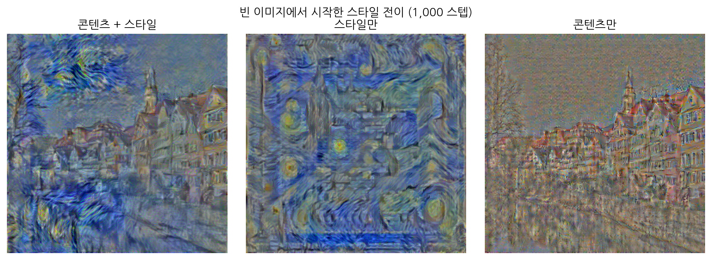
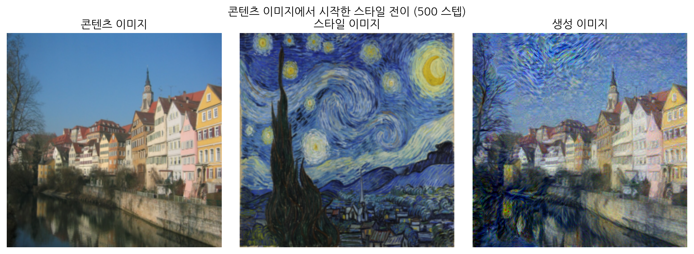
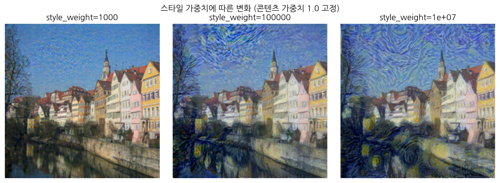

# 스타일 전이 — 모델 대신 이미지를 최적화하기

> **11장 11-2절 심화 학습 자료**
> 예제 노트북: [`style_transfer_example.ipynb`](style_transfer_example.ipynb)
> 선수 지식: 5장(합성곱 신경망의 계층별 특징), 7장(전이 학습과 특징 추출), 11장(이미지 생성 전략)

11장은 이미지를 만드는 두 가지 방법을 다뤘다. 변분 오토인코더는 잠재 공간에서 벡터를 뽑아 디코더로 이미지를 만들었고, DCGAN은 생성자와 판별자를 경쟁시켜 만들었다. 둘 다 **모델의 파라미터를 최적화해** 이미지를 만드는 방식이다.

스타일 전이는 다르다. **모델은 고정해 두고 이미지의 픽셀을 직접 최적화한다.** 11장 첫머리에 등장한, 독일 튀빙겐 거리 사진에 <별이 빛나는 밤>의 화풍을 입힌 이미지가 바로 이 방법으로 만들어졌다.

이 글은 그 방법을 다룬다. 이미지를 만드는 또 하나의 전략이기도 하지만, 그보다 **최적화의 대상이 반드시 모델 파라미터일 필요는 없다**는 관점을 얻는 것이 더 큰 수확이다.

---

## 1. 무엇을 최적화할 것인가

컴퓨터로 화풍을 옮기려는 시도는 딥러닝 이전부터 있었다. 사진에 붓 터치나 수채화 효과를 입히는 **비실사 렌더링**(non-photorealistic rendering)은 컴퓨터 그래픽스의 오랜 주제였고, 주로 픽셀의 통계적 특성을 분석해 대상 이미지에 더하는 방식을 썼다. 다만 화풍을 옮기기보다는 양식화된 효과를 입히는 쪽에 가까웠다.

딥러닝은 다른 길을 열었다. 발상은 단순하다.

> 딥러닝이 손실을 줄이는 방향으로 **모델 파라미터**를 최적화하듯,
> 목적에 맞는 손실 함수를 정의할 수 있다면 **이미지의 픽셀값**도 같은 방식으로 최적화할 수 있다.

지금까지 배운 학습과 비교하면 고정된 것과 움직이는 것이 뒤바뀐다.

| | 일반적인 학습 | 스타일 전이 |
|---|---|---|
| 고정 | 데이터 | **모델 파라미터** |
| 갱신 | 모델 파라미터 | **이미지 픽셀** |
| 손실 | 예측과 정답의 차이 | 생성 이미지와 두 기준 이미지의 특징 차이 |
| 끝났을 때 얻는 것 | 학습된 모델 | **이미지 한 장** |

마지막 줄이 중요하다. 스타일 전이의 결과물은 모델이 아니라 **이미지 한 장**이다. 다른 사진에 같은 화풍을 입히려면 처음부터 다시 최적화해야 한다.

물론 딥러닝 모델을 쓰지 않는 것은 아니다. **스타일도 결국 이미지의 특징**이고, 특징을 뽑는 데는 합성곱 신경망이 가장 적합하다. 이미 학습된 모델로 특징을 추출한 뒤, 그 특징을 기준으로 픽셀을 최적화한다.

필요한 것은 세 가지다.

1. 이미지에서 **콘텐츠와 스타일을 분리해 측정**할 방법
2. 그 측정을 맡을 **특징 추출기**
3. 모델이 아니라 **이미지를 최적화**하는 방법

차례로 풀어 보자.

---

## 2. 콘텐츠와 스타일을 어떻게 나눌 것인가

### 2.1 계층의 깊이가 답의 절반이다

5장에서 합성곱 계층을 깊이 쌓은 모델은 **깊은 계층일수록 사물의 형태나 위치 같은 고수준 특징**을, **얕은 계층일수록 색 분포, 질감, 붓 터치 같은 저수준 특징**을 추출한다고 배웠다.

2015년 독일 튀빙겐 대학교의 레온 가티스(Leon Gatys)는 이 성질에 주목했다. 사전 학습된 VGG-19 하나로 두 가지를 모두 뽑아낼 수 있다는 것이다.

- **콘텐츠 특징** — 출력에 가까운 **한 계층**의 특징 지도. 그림에 무엇이 그려져 있는지를 담는다.
- **스타일 특징** — 얕은 계층부터 깊은 계층까지 **여러 계층**의 특징 지도. 붓 터치부터 전체 색조까지 고루 담는다.

콘텐츠 손실은 두 특징 지도를 **그대로** 비교하면 된다. 생성 이미지의 특징 지도와 콘텐츠 이미지의 특징 지도 사이의 평균제곱오차다. 이 값이 작을수록 생성 이미지의 구조와 내용이 콘텐츠 이미지에 가깝다.

문제는 스타일이다. 특징 지도를 그대로 비교하면 **위치까지 같아지려 한다.** 그러면 스타일이 아니라 스타일 이미지 자체를 베끼게 된다. 화풍은 "어디에 무엇이 있는가"가 아니라 "전반적으로 어떤 느낌인가"이므로, **공간 정보를 버리고 남는 것**을 봐야 한다.

### 2.2 그람 행렬 — 공간을 버리고 관계만 남기기

합성곱 신경망은 이미지의 특징을 **채널별로 나눠** 추출한다. 1번 채널이 '노란색', 2번 채널이 '소용돌이 모양'을 잡아낸다고 하자. 그러면 1번 채널의 특징 지도는 노란 영역에서, 2번 채널의 특징 지도는 소용돌이가 있는 영역에서 큰 값을 가진다.

**그람 행렬**(Gram matrix)은 채널끼리 내적해 만든 정사각 행렬이다. `(i, j)` 요소는 채널 `i`와 채널 `j`의 값을 **이미지 전체에 걸쳐** 곱해 더한 값이다.

여기서 두 가지 일이 동시에 일어난다.

- **같은 위치에서 두 특징이 함께 강하면** 곱이 커진다. 노란색과 소용돌이가 같은 자리에 있으면 `(1, 2)` 요소가 커진다.
- **이미지 전체에 걸쳐 더하므로** 그 일이 **어디에서** 일어났는지는 사라진다.

남는 것은 "**어떤 특징들이 함께 나타나는가**"뿐이다. <별이 빛나는 밤>이라면 '노란색 + 소용돌이'가 강하게 결합되어 있을 것이고, 그 결합 패턴은 그림의 어느 부분을 보든 비슷하다.

> **그람 행렬은 구체적인 형태를 지우고 스타일만 남긴 일종의 스타일 지문이다.**

두 이미지의 그람 행렬이 비슷하다는 것은, 픽셀값은 달라도 **질감·색조·분위기가 비슷하다**는 뜻이다.

```python
# (B, C, H, W) 형태의 특징 지도로 (B, C, C) 형태의 그람 행렬을 만든다
def gram_matrix(feature):
    B, C, H, W = feature.shape
    # 채널 단위의 1차원 벡터로 펼침: 공간 정보를 한 줄로 늘어놓는다
    f = feature.view(B, C, H * W)
    # 채널 벡터 사이의 내적 = 채널별 특징이 함께 나타나는 강도
    gram = torch.bmm(f, f.transpose(1, 2))      # (B, C, C)
    # 계층마다 채널 수와 공간 크기가 달라 정규화하지 않으면 한 계층이 압도한다
    return gram / (C * H * W)
```

**세 줄 모두 이유가 있다.**

**`view(B, C, H * W)`** — 내적은 1차원 벡터 사이의 연산이다. 세로와 가로를 한 축으로 펼쳐 채널마다 길이 `H*W`인 벡터를 만든다. **이 순간 공간 구조가 사라진다.** 픽셀을 어떤 순서로 늘어놓든 내적값은 같기 때문이다. 스타일에서 위치를 지우는 일이 바로 여기서 일어난다.

**`torch.bmm(f, f.transpose(1, 2))`** — `(B, C, H*W)`와 `(B, H*W, C)`를 배치 행렬곱해 `(B, C, C)`를 얻는다. 배치 안의 모든 샘플을 한 번에 처리한다.

**`/ (C * H * W)`** — 얕은 계층은 채널이 적고 특징 지도가 크며, 깊은 계층은 반대다. 정규화하지 않으면 특정 계층의 스타일 손실이 다른 계층을 압도한다. 여러 계층의 손실을 **비슷한 눈금으로 맞추는** 장치다.

### 2.3 두 손실을 합칠 때

콘텐츠 손실과 스타일 손실을 그냥 더하면 한쪽이 다른 쪽을 압도한다. 각각에 가중치를 곱해 더한다.

```
전체 손실 = content_weight × 콘텐츠 손실 + style_weight × 스타일 손실
```

**가중치의 기본값이 `1.0`과 `1e5`로 10만 배나 차이 나는 이유**를 짚어 두자. 두 손실의 계산 방식이 다르기 때문이다.

- 콘텐츠 손실은 **특징 지도의 픽셀별 오차**를 제곱 평균한 값이다.
- 스타일 손실은 **정규화한 그람 행렬의 요소별 오차**를 제곱 평균한 값이다. `/ (C * H * W)`로 이미 한 번 작게 만든 값을 다시 제곱하므로 훨씬 작아진다.

즉 10만이라는 숫자 자체에 의미가 있는 것이 아니라, **두 손실항에 가중치를 곱한 결과가 비슷한 크기가 되도록** 맞춘 것이다. 이미지 크기나 채널 수가 바뀌면 이 비율도 다시 잡아야 한다.

11-1절 VAE의 복원 손실과 KL 발산에서 본 것과 같은 구조다. **손실이 여러 항으로 이루어질 때는 항상 균형을 먼저 확인해야 한다.**

---

## 3. 특징 추출기 만들기

### 3.1 VGG-19를 고정해 재활용한다

```python
class VGG19FeatureExtractor(nn.Module):
    def __init__(self, content_layer_idxs, style_layer_idxs):
        super().__init__()
        # ImageNet으로 학습한 파라미터로 초기화한 VGG-19
        vgg = models.vgg19(weights=models.VGG19_Weights.IMAGENET1K_V1)
        # 분류기는 쓰지 않고 합성곱 블록(features)만 사용
        self.features = vgg.features
        self.content_layer_idxs = content_layer_idxs
        self.style_layer_idxs = style_layer_idxs
        # 이미지를 최적화할 때 VGG-19가 함께 갱신되지 않도록 고정
        for param in self.parameters():
            param.requires_grad = False

    def forward(self, x):
        content_features, style_features = {}, {}
        # 계층을 순서대로 통과시키며 지정한 위치의 특징 지도를 수집
        for idx, layer in enumerate(self.features):
            x = layer(x)
            if idx in self.content_layer_idxs:
                content_features[idx] = x
            if idx in self.style_layer_idxs:
                style_features[idx] = x
        return content_features, style_features
```

**`requires_grad = False`가 이 글의 핵심 한 줄이다.** 7장의 특징 추출 방식 전이 학습에서 사전 학습 모델을 고정한 것과 같은 코드인데, 목적이 다르다. 7장에서는 **새로 붙인 분류기**를 학습하려고 고정했지만, 여기서는 **입력 이미지**를 학습하려고 고정한다.

기울기는 여전히 VGG-19를 **거쳐** 흐른다. 다만 그 끝이 모델 파라미터가 아니라 입력 이미지일 뿐이다.

**`forward()`가 중간 출력을 모으는 구조**에도 주목하자. 보통 모델은 마지막 출력만 돌려주지만, 여기서는 여러 계층의 특징 지도가 필요하다. `nn.Sequential`을 그대로 호출하는 대신 계층을 하나씩 돌며 필요한 것을 수집한다.

> **8장 심화 학습 자료의 파이토치 훅으로도 같은 일을 할 수 있다.** 훅을 쓰면 `forward()`를 새로 쓰지 않고도 중간 특징을 꺼낼 수 있다. 여기서는 추출할 계층이 미리 정해져 있고 구조가 단순해 직접 순회하는 쪽을 택했다. 남이 만든 모델을 고칠 수 없을 때는 훅이 유일한 방법이 된다.

### 3.2 어느 계층에서 뽑을 것인가

```python
# 콘텐츠: 출력에 가까운 한 계층
content_layer_idxs = [21]
# 스타일: 얕은 곳부터 깊은 곳까지 고루
style_layer_idxs = [0, 5, 10, 19, 28]
```

`torchvision`의 VGG-19에서 `features`는 `nn.Sequential`이라 배치 순서 인덱스로 계층을 가리킬 수 있다. 합성곱 계층은 모두 16개다.

- **콘텐츠는 인덱스 21**(열 번째 합성곱 계층) 하나만 쓴다. 중간보다 약간 깊은 위치다.
- **스타일은 인덱스 0, 5, 10, 19, 28**(첫 번째부터 열세 번째까지) 다섯 곳을 쓴다.

**콘텐츠에 가장 깊은 계층을 쓰지 않는 이유**가 궁금할 것이다. 깊은 계층일수록 '무엇이 그려져 있는가'는 잘 담지만 **'어디에 어떻게'는 잃는다.** 분류에 필요 없는 정보이기 때문이다. 가장 깊은 계층의 특징만 맞추면 "건물과 강이 있다"는 사실만 지켜지고 구도는 흐트러진다. 반대로 너무 얕은 계층을 쓰면 픽셀을 거의 그대로 베끼게 되어 스타일이 들어갈 자리가 없다. **인덱스 21은 그 사이의 타협점**이다. 연습 문제 2에서 직접 확인한다.

### 3.3 입력 이미지 맞추기

```python
IMG_SIZE = 256

def load_image(path, size=IMG_SIZE):
    img = Image.open(path).convert('RGB')
    transform = transforms.Compose([
        transforms.Resize((size, size)),
        transforms.ToTensor(),
        # VGG-19가 학습된 ImageNet의 정규화 값을 그대로 쓴다
        transforms.Normalize(mean=[0.485, 0.456, 0.406],
                             std=[0.229, 0.224, 0.225]),
    ])
    return transform(img).unsqueeze(0).to(device)
```

VGG-19는 ImageNet을 평균 `[0.485, 0.456, 0.406]`, 표준편차 `[0.229, 0.224, 0.225]`로 정규화해 학습했다. **모델을 재활용하려면 입력 분포도 맞춰야 한다.** 7장에서 사전 학습 모델을 쓸 때와 같은 규칙이다.

이 정규화 때문에 **결과를 볼 때는 되돌려야 한다.** 예제 노트북의 `denormalize()`가 그 일을 한다.

---

## 4. 이미지를 최적화하기

### 4.1 두 가지 준비

이미지 텐서를 모델 파라미터처럼 다루려면 두 가지가 필요하다.

```python
# ① 이미지 텐서를 최적화 대상으로 만든다
generated = init_img.clone().detach().requires_grad_(True)
# ② 모델 파라미터가 아니라 이 텐서를 옵티마이저에 넘긴다
optimizer = optim.Adam([generated], lr=0.03)
```

`optim.Adam(model.parameters(), ...)`에서 `model.parameters()`는 파라미터 텐서의 이터러블이다. 그 자리에 **텐서 하나를 담은 리스트**를 넣으면 그 텐서가 최적화 대상이 된다. 옵티마이저는 대상이 모델 파라미터인지 이미지인지 구분하지 않는다.

**`clone().detach()`를 빠뜨리면 안 된다.** 콘텐츠 이미지에서 출발할 때 복사하지 않으면 **콘텐츠 이미지 자체가 함께 바뀐다.** 기준이 움직여 버리므로 최적화가 무의미해진다.

### 4.2 학습 루프

```python
# 기준 특징은 한 번만 추출한다(두 기준 이미지는 바뀌지 않는다)
with torch.no_grad():
    content_image_features, _ = feature_extractor(content_img)
    _, style_image_features = feature_extractor(style_img)

for step in range(1, steps + 1):
    optimizer.zero_grad()
    # 생성 이미지는 매 스텝 바뀌므로 특징도 매번 새로 뽑는다
    gen_content, gen_style = feature_extractor(generated)
    loss, content_loss, style_loss = criterion(
        gen_content, gen_style,
        content_image_features, style_image_features,
        content_weight, style_weight,
    )
    loss.backward()
    optimizer.step()
    # 정규화 범위를 크게 벗어나는 픽셀값을 잘라 낸다
    with torch.no_grad():
        generated.clamp_(-3, 3)
```

일반적인 학습 루프와 모양이 똑같다. 바뀐 것은 **최적화 대상**과 **손실의 정의**뿐이다.

**기준 특징을 밖에서 한 번만 뽑는 것**은 단순한 최적화가 아니다. `torch.no_grad()` 안에서 뽑아 **연산 그래프에서 떼어 두어야** 기준이 기울기 계산에 끼어들지 않는다. 11-2절에서 판별자를 학습할 때 `detach()`를 쓴 것과 같은 발상이다.

**`clamp_(-3, 3)`은 안전장치다.** ImageNet 이미지는 정규화 후 채널별 픽셀값이 대체로 `-2.1`에서 `2.6` 범위에 들어온다. 최적화 과정에서 픽셀이 그 바깥으로 튀면 **VGG-19가 본 적 없는 입력**이 되어 특징 추출이 엉뚱해진다. `-3`에서 `3`으로 제한하면 약간의 여유는 주면서 극단값은 막는다.

### 4.3 학습률이 큰 이유

모델 학습에서는 `1e-3` 언저리를 쓰는데 여기서는 **`0.03`**을 쓴다. 30배다. 이유가 두 가지 있다.

**하나, 정답이 고정되어 있다.** 모델 학습은 데이터가 배치마다 바뀌어 손실 지형이 계속 흔들리지만, 스타일 전이는 콘텐츠와 스타일이 처음부터 끝까지 그대로다. 같은 목표를 향해 계속 내려가므로 큰 걸음이 안전하다.

**둘, 픽셀은 서로 독립적이다.** 모델 파라미터 하나는 여러 출력에 연쇄적으로 영향을 주지만, **이미지의 픽셀은 각자 독립적인 최적화 대상**이다. 한 픽셀이 크게 움직여도 다른 픽셀이 망가지지 않는다.

> **가티스의 원 논문은 Adam 대신 L-BFGS를 썼다.** L-BFGS는 2차 미분 정보를 근사해 쓰는 옵티마이저로, 최적화 대상이 적고 정답이 고정된 문제에서 훨씬 빠르게 수렴한다. 스타일 전이는 그 조건에 정확히 들어맞는다. 다만 `optim.LBFGS`는 손실을 다시 계산하는 `closure` 함수를 넘겨야 해서 학습 루프의 모양이 달라진다. 이 글은 지금까지 써 온 형태를 유지하려고 Adam을 썼다.

---

## 5. 결과 읽기

### 5.1 빈 이미지에서 시작하면

`torch.zeros_like(content_img)`로 시작해 1,000 스텝을 돌린 결과다. 비교를 위해 가중치 하나를 0으로 둔 두 경우도 함께 실행했다.



**뒤의 두 결과부터 보는 것이 순서다.**

- **스타일만**(콘텐츠 가중치 0) — 화면이 스타일로 가득 찬다. 내용은 없지만 질감과 색조는 <별이 빛나는 밤> 그대로다.
- **콘텐츠만**(스타일 가중치 0) — 튀빙겐 거리의 형태가 **희미하게만** 떠오른다.

**여기서 중요한 사실이 드러난다. 1,000 스텝은 스타일을 옮기기에는 충분하지만 콘텐츠를 베껴 오기에는 짧다.** 그래서 둘을 함께 쓴 첫 번째 결과도 "스타일이 전이된 그림"이라기보다 **"흐릿한 콘텐츠 위에 스타일을 겹쳐 놓은 것"**에 가깝다.

왜 콘텐츠가 더 느릴까? 스타일 손실은 **공간 정보를 버린** 그람 행렬을 맞추므로 픽셀을 대충 배치해도 값이 빠르게 내려간다. 반면 콘텐츠 손실은 **특징 지도의 자리마다** 값을 맞춰야 하므로 훨씬 까다롭다.

### 5.2 콘텐츠 이미지에서 시작하면

해법은 간단하다. **백지 대신 콘텐츠 이미지에서 출발한다.**

```python
generated = content_img.clone().detach().requires_grad_(True)
```

이 한 줄로 문제의 성격이 바뀐다. "빈 화폭에 콘텐츠와 스타일을 모두 그린다"에서 **"이미 있는 콘텐츠를 지키면서 스타일만 입힌다"**로 바뀐다. 콘텐츠 손실은 시작부터 0에 가까우므로 최적화는 스타일을 입히는 데 집중한다.



500 스텝만으로 훨씬 나은 결과가 나온다. **초기값을 바꾸는 것만으로 절반의 스텝에 더 좋은 결과를 얻은 셈**이다. 최적화 문제에서 출발점이 얼마나 중요한지 보여 주는 사례다.

### 5.3 가중치로 강도 조절하기

콘텐츠 가중치를 `1.0`으로 두고 스타일 가중치만 `1e3`, `1e5`, `1e7`로 바꿔 본 결과다.



- **`1e3`** — 스타일이 거의 보이지 않는다. 원본 사진에 가깝다.
- **`1e5`** — 기본값. 내용을 알아볼 수 있으면서 화풍이 뚜렷하다.
- **`1e7`** — 스타일이 지나쳐 **건물의 구조가 무너지기 시작한다.**

**가중치는 '스타일의 강도 손잡이'다.** 다만 세 번째 결과가 보여 주듯, 스타일을 강하게 입힌다는 것은 곧 **콘텐츠 이미지에서 멀어진다**는 뜻이다. 둘은 근본적으로 맞바꿈 관계이므로 적정선을 찾는 수밖에 없다. 왜곡이 거슬린다면 학습률과 스텝 수를 함께 조절해 완화할 수도 있다.

---

## 6. 정리와 그다음

**스타일 전이가 보여 주는 것은 기법 하나가 아니라 관점이다.**

| | 내용 |
|---|---|
| 최적화 대상 | 모델 파라미터가 아니어도 된다. **기울기가 흐르는 텐서면 무엇이든** 가능하다 |
| 손실 함수 | 파이토치가 주는 것을 쓰지 않아도 된다. **목적을 수식으로 옮길 수 있으면** 만들면 된다 |
| 사전 학습 모델 | 분류에만 쓰는 것이 아니다. **특징 추출기로 재활용**할 수 있다 |
| 여러 손실항 | 합치기 전에 **눈금이 맞는지** 먼저 확인해야 한다 |

이 관점은 다른 곳에서도 쓰인다. 입력을 최적화해 모델을 속이는 **적대적 예제**(adversarial example), 특정 뉴런을 최대로 활성화하는 입력을 찾아 모델이 무엇을 보는지 알아내는 **특징 시각화**(feature visualization)가 모두 같은 구조다.

**한계도 분명하다.** 이 방법은 이미지 한 장마다 수백 번의 최적화가 필요하다. 실시간으로는 쓸 수 없다. 11장 학습 노트가 언급한 **AdaIN**(adaptive instance normalization)은 이 문제를 푼다. 스타일을 "특징 지도의 채널별 평균과 표준편차"로 보고, 콘텐츠 특징의 통계를 스타일 특징의 통계로 바꿔치기하는 방식이다. 최적화 없이 **단일 순전파**로 끝나므로 영상에도 적용할 수 있다.

---

## 연습 문제

### 1. 가중치의 비율과 절댓값

예제에서 쓰지 않은 스타일 가중치를 골라 가장 마음에 드는 결과를 찾아보자. 이때 **콘텐츠 가중치도 `0.1`, `1.0`, `10.0` 등으로 함께 바꿔 가며**, 두 가중치의 **비율**이 결과를 좌우하는지 아니면 **절댓값**도 영향을 주는지 정리해 보자.

> 힌트: 두 가중치에 같은 수를 곱하면 손실의 크기만 바뀌고 비율은 그대로다. 그때 결과가 같은지 다른지 확인해 보면 학습률과의 관계가 드러난다.

### 2. 콘텐츠 특징을 뽑는 계층 바꾸기

예제는 VGG-19의 16개 합성곱 계층 중 열 번째(인덱스 21)에서 콘텐츠 특징을 뽑는다. 이를 각각 **첫 번째, 여섯 번째, 열여섯 번째** 합성곱 계층으로 바꿔 결과를 확인한 뒤, 열 번째라는 선택이 타당한지 평가해 보자.

> 계층 인덱스는 `feature_extractor.features`를 출력해 확인할 수 있다.

### 3. 고주파 스타일과 저주파 스타일 나누기

스타일은 규모에 따라 나눌 수 있다. **미세한 붓 터치나 캔버스 질감** 같은 작은 규모의 특징(고주파)과, **전반적인 색조나 큼직한 형태의 왜곡** 같은 큰 규모의 특징(저주파)이다.

특정 범위(예를 들어 13x13 영역) 안에서만 관찰되는 특징을 고주파, 그보다 큰 것을 저주파로 정의할 때, VGG-19를 특징 추출기로 쓰면서 **고주파만** 또는 **저주파만** 전이하는 방법을 제시하고 구현해 보자.

> 힌트: 계층이 깊어질수록 한 뉴런이 보는 원본 영역(수용 영역)이 넓어진다. `style_layer_idxs`를 어떻게 고르면 될지 생각해 보자.

### 4. [도전 문제] 스타일 이미지의 크기 바꾸기

스타일 이미지는 생성 이미지와 같은 크기일 필요가 없다. `data/starry_night.jpg`는 원래 큰 이미지인데 예제는 256x256으로 줄여 쓴다. **크기를 줄이지 않고 그대로** 사용해 전이해 보고, 결과에 어떤 차이가 있는지 확인해 보자.

> 왜 크기가 달라도 되는지 먼저 생각해 보자. 그람 행렬의 형태는 무엇으로 정해지는가?

### 5. [도전 문제] 두 화풍 섞기

<별이 빛나는 밤>과 쌍벽을 이루는 표현주의 명작으로 에드바르 뭉크의 <절규>(`data/the_scream.jpg.jpg`)가 있다. 두 그림의 스타일을 **동시에** 전이해 <별이 절규하는 튀빙겐 거리>를 만들어 보자.

> 손실 함수에 스타일 항을 하나 더 두고 가중치를 나누면 된다. 두 화풍의 비중을 조절해 보자.

---

## 사용하는 데이터와 모델

| 파일 | 용도 |
|---|---|
| `data/Tuebingen_Neckarfront.jpg` | 콘텐츠 이미지(독일 튀빙겐 네카어 강변) |
| `data/starry_night.jpg` | 스타일 이미지(반 고흐, <별이 빛나는 밤>) |
| `data/the_scream.jpg.jpg` | 스타일 이미지(뭉크, <절규>) — 연습 문제 5 |

| 모델 | 출처 | 사전 학습 데이터 | 라이선스 |
|---|---|---|---|
| VGG-19 | `torchvision` 내장 모델(`models.vgg19`) | ImageNet-1k | BSD-3-Clause |

## 실행 환경

예제 노트북은 저장소 전체를 내려받은 상태에서 이 디렉터리 안에서 실행하는 것을 전제로 한다. 공통 라이브러리(`code_reference`)를 사용하므로, 저장소를 통째로 clone하지 않았다면 `code_reference/README.md`를 먼저 확인하자.

VGG-19 사전 학습 가중치를 내려받으므로 **첫 실행에는 네트워크 연결이 필요하다**(약 550MB). CPU에서도 동작하지만 한 번의 전이에 수 분이 걸리므로 GPU 환경을 권한다.
